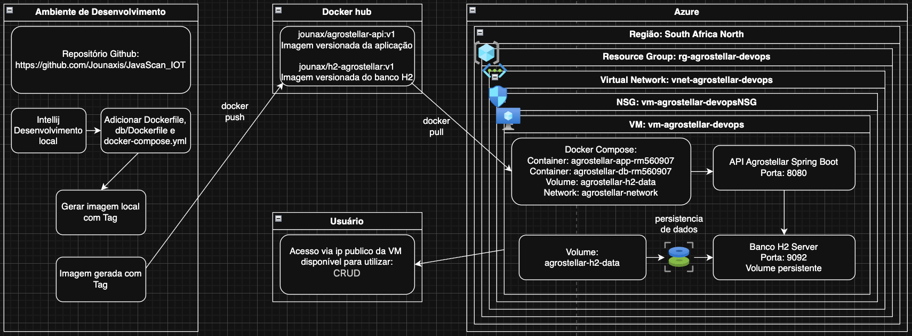

# Agrostellar API

Projeto desenvolvido para a disciplina de **DevOps Tools & Cloud Computing**, com o objetivo de conteinerizar uma aplicação Java Spring Boot com banco de dados H2, utilizando Docker, Docker Compose, Docker Hub e provisionamento em nuvem com Azure CLI.

A solução consiste em uma API Java executada em um container Docker e integrada a um banco de dados H2 executado em outro container. O ambiente final é executado dentro de uma VM Linux na Azure.

---

## Integrante representante

- **RM:** 560907

---

## Objetivo do projeto

O objetivo do projeto Agrostellar é disponibilizar uma API Java Spring Boot conteinerizada, com persistência de dados em um banco H2 executado separadamente em outro container.

A entrega contempla:

- Criação de ambiente em nuvem com Azure CLI.
- Execução de dois containers Docker integrados.
- Um container para a aplicação Java Spring Boot.
- Um container para o banco de dados H2.
- Imagens Docker versionadas no Docker Hub.
- Uso de Docker Compose para orquestração dos containers.
- Comunicação entre aplicação e banco pela mesma rede Docker.
- Uso de volume nomeado para persistência dos dados.
- Nome dos containers contendo o RM do representante.
- Execução dos containers em background.
- Exibição de logs dos containers.
- Acesso aos containers via `docker container exec`.
- Demonstração de persistência dos dados no banco.

---

## Tecnologias utilizadas

- Java 21
- Spring Boot
- Spring Data JPA
- H2 Database
- Gradle
- Docker
- Docker Compose
- Docker Hub
- Azure CLI
- Ubuntu 22.04

---

## Arquitetura macro

A arquitetura da solução segue o fluxo abaixo:

```text
Ambiente de Desenvolvimento
        ↓
Criação dos Dockerfiles e docker-compose.yml
        ↓
Build das imagens locais com tag de versão
        ↓
Push das imagens para o Docker Hub
        ↓
Provisionamento da VM na Azure
        ↓
Clone do repositório dentro da VM
        ↓
Pull das imagens versionadas
        ↓
Execução dos containers com Docker Compose
        ↓
Aplicação disponível via IP público da VM
````

### Diagrama da arquitetura



---

## Descrição da arquitetura

```text
Azure Cloud
│
└── Resource Group: rg-agrostellar-devops
    │
    └── VM Linux: vm-agrostellar-devops
        │
        ├── Docker Engine
        ├── Docker Compose
        │
        ├── Network: agrostellar-network
        │   │
        │   ├── Container: agrostellar-app-rm560907
        │   │   ├── Imagem: jounax/agrostellar-api:v1
        │   │   ├── Aplicação Java Spring Boot
        │   │   ├── Porta: 8080
        │   │   ├── Diretório de trabalho: /app
        │   │   └── Usuário não privilegiado: agrostellar
        │   │
        │   └── Container: agrostellar-db-rm560907
        │       ├── Imagem: jounax/h2-agrostellar:v1
        │       ├── Banco H2 Server
        │       ├── Porta TCP: 9092
        │       ├── Console Web: 8082
        │       └── Volume persistente
        │
        └── Volume nomeado:
            └── agrostellar-h2-data
```

---

## Imagens Docker publicadas

As imagens utilizadas no projeto foram publicadas no Docker Hub com versionamento:

```text
jounax/agrostellar-api:v1
jounax/h2-agrostellar:v1
```

A imagem da aplicação contém a API Java Spring Boot.

A imagem do banco contém o H2 configurado em modo server.

---

## Containers do projeto

Os containers são criados pelo Docker Compose com nomes contendo o RM do representante da equipe:

```text
agrostellar-app-rm560907
agrostellar-db-rm560907
```

Isso atende ao requisito:

> O nome do Container deve conter o RM do representante da equipe.

---

## Estrutura esperada do projeto

```text
JavaScan_IOT/
├── Dockerfile
├── docker-compose.yml
├── .dockerignore
├── db/
│   └── Dockerfile
├── src/
├── build.gradle
├── settings.gradle
├── gradlew
├── gradle/
├── docs/
│   └── arquitetura-agrostellar.png
└── README.md
```

---

## Dockerfile da aplicação

O container da aplicação utiliza uma imagem personalizada, gerada a partir do `Dockerfile` localizado na raiz do projeto.

Principais configurações:

* Build com Gradle.
* Execução com Java 21.
* Diretório de trabalho definido.
* Usuário não privilegiado.
* Uso de variável de ambiente.
* Porta exposta para acesso à aplicação.

```dockerfile
# Etapa 1: build da aplicação com Gradle e Java 21
FROM gradle:8.14.3-jdk21 AS builder

WORKDIR /build

COPY build.gradle settings.gradle ./
COPY gradle ./gradle
COPY gradlew ./

RUN chmod +x ./gradlew

COPY src ./src

RUN ./gradlew clean bootJar -x test


# Etapa 2: execução da aplicação
FROM eclipse-temurin:21-jre

WORKDIR /app

RUN groupadd -r agrostellar && useradd -r -g agrostellar agrostellar

COPY --from=builder /build/build/libs/*.jar app.jar

ENV SPRING_PROFILES_ACTIVE=docker
ENV SERVER_PORT=8080

EXPOSE 8080

USER agrostellar

ENTRYPOINT ["java", "-jar", "app.jar"]
```

---

## Dockerfile do banco H2

O container do banco H2 também utiliza uma imagem personalizada.

Arquivo:

```text
db/Dockerfile
```

```dockerfile
FROM eclipse-temurin:21-jre

WORKDIR /opt/h2

ENV H2_VERSION=2.2.224
ENV H2_TCP_PORT=9092
ENV H2_WEB_PORT=8082

RUN mkdir -p /opt/h2-data

ADD https://repo1.maven.org/maven2/com/h2database/h2/${H2_VERSION}/h2-${H2_VERSION}.jar /opt/h2/h2.jar

EXPOSE 9092
EXPOSE 8082

CMD ["sh", "-c", "java -cp /opt/h2/h2.jar org.h2.tools.Server -tcp -tcpAllowOthers -tcpPort ${H2_TCP_PORT} -web -webAllowOthers -webPort ${H2_WEB_PORT} -ifNotExists -baseDir /opt/h2-data"]
```

---

## Docker Compose

O arquivo `docker-compose.yml` é responsável por executar os dois containers na mesma rede Docker.

```yaml
services:
  agrostellar-db:
    image: jounax/h2-agrostellar:v1
    container_name: agrostellar-db-rm560907
    restart: always
    environment:
      H2_VERSION: 2.2.224
      H2_TCP_PORT: 9092
      H2_WEB_PORT: 8082
    ports:
      - "9092:9092"
      - "8082:8082"
    volumes:
      - agrostellar-h2-data:/opt/h2-data
    networks:
      - agrostellar-network

  agrostellar-app:
    image: jounax/agrostellar-api:v1
    container_name: agrostellar-app-rm560907
    restart: always
    depends_on:
      - agrostellar-db
    environment:
      SPRING_APPLICATION_NAME: agrostellar-api
      SERVER_PORT: 8080
      SPRING_DATASOURCE_URL: jdbc:h2:tcp://agrostellar-db:9092/agrostellar
      SPRING_DATASOURCE_DRIVER_CLASS_NAME: org.h2.Driver
      SPRING_DATASOURCE_USERNAME: sa
      SPRING_DATASOURCE_PASSWORD: ""
      SPRING_JPA_HIBERNATE_DDL_AUTO: update
      SPRING_JPA_SHOW_SQL: "true"
      SPRING_H2_CONSOLE_ENABLED: "true"
      SPRING_H2_CONSOLE_PATH: /h2-console
    ports:
      - "8080:8080"
    networks:
      - agrostellar-network

volumes:
  agrostellar-h2-data:

networks:
  agrostellar-network:
    driver: bridge
```

---

## Provisionamento da VM na Azure

O provisionamento da VM é realizado por um script Azure CLI.

O script cria:

* Resource Group.
* Máquina virtual Linux Ubuntu.
* VM com pelo menos 8 GB de RAM.
* Portas necessárias abertas.
* Docker instalado.
* Docker Compose instalado.
* Git e ferramentas auxiliares instalados.

### Portas utilizadas

```text
22    - SSH
80    - HTTP
443   - HTTPS
8080  - Aplicação Java Spring Boot
8081  - Porta alternativa para aplicação
9092  - H2 TCP Server
8082  - H2 Web Console
```

---

## Como executar o projeto em nuvem

### 1. Provisionar a VM

Na máquina local, execute o script de provisionamento:

```bash
chmod +x ./deploy_agrostellar.sh
./deploy_agrostellar.sh
```

Ao final da execução, o script exibirá o IP público da VM.

Exemplo:

```text
Provisionamento finalizado!
Projeto: Agrostellar
Resource Group: rg-agrostellar-devops
VM: vm-agrostellar-devops
IP público: XX.XX.XX.XX
```

---

### 2. Acessar a VM via SSH

Substitua `IP_PUBLICO_DA_VM` pelo IP exibido no final do script.

```bash
ssh rm560907@IP_PUBLICO_DA_VM
```

Depois valide a instalação do Docker:

```bash
docker --version
docker compose version
```

Caso o comando `docker` solicite permissão, saia da sessão SSH e entre novamente:

```bash
exit
ssh rm560907@IP_PUBLICO_DA_VM
```

---

### 3. Clonar o repositório dentro da VM

Dentro da VM, execute:

```bash
git clone https://github.com/Jounaxis/JavaScan_IOT.git
```

Entre na pasta do projeto:

```bash
cd JavaScan_IOT
```

Liste os arquivos:

```bash
ls -l
```

Confirme se o arquivo `docker-compose.yml` está presente.

---

### 4. Fazer pull das imagens Docker

Dentro da pasta do projeto, execute:

```bash
docker compose pull
```

Esse comando irá baixar as imagens versionadas do Docker Hub:

```text
jounax/agrostellar-api:v1
jounax/h2-agrostellar:v1
```

Para confirmar:

```bash
docker images
```

---

### 5. Subir os containers em background

Execute:

```bash
docker compose up -d
```

Verifique se os containers estão rodando:

```bash
docker ps
```

A saída deve apresentar os containers:

```text
agrostellar-app-rm560907
agrostellar-db-rm560907
```

---

## Exibição dos logs

O requisito solicita a exibição dos logs dos containers no terminal.

Para exibir os logs da aplicação:

```bash
docker compose logs agrostellar-app
```

Para exibir os logs do banco:

```bash
docker compose logs agrostellar-db
```

Para exibir todos os logs:

```bash
docker compose logs
```

---

## Acesso aos containers

O requisito solicita acessar os containers com `docker container exec` e demonstrar:

* Estrutura de diretórios.
* Diretório atual.
* Usuário conectado.

### Acessar o container da aplicação

```bash
docker container exec -it agrostellar-app-rm560907 sh
```

Dentro do container, execute:

```bash
pwd
ls -l
whoami
```

Resultado esperado para o usuário:

```text
agrostellar
```

Esse resultado comprova que a aplicação está executando com usuário não privilegiado.

Para sair:

```bash
exit
```

---

### Acessar o container do banco

```bash
docker container exec -it agrostellar-db-rm560907 sh
```

Dentro do container, execute:

```bash
pwd
ls -l
whoami
```

Para sair:

```bash
exit
```

---

## Acesso à aplicação

A aplicação fica disponível na porta `8080`.

Dentro da VM:

```bash
curl http://localhost:8080
```

Pelo navegador da máquina local:

```text
http://IP_PUBLICO_DA_VM:8080
```

Caso o Swagger esteja habilitado:

```text
http://IP_PUBLICO_DA_VM:8080/swagger-ui/index.html
```

---

## Acesso ao H2 Console

O H2 Web Console fica disponível na porta `8082`.

```text
http://IP_PUBLICO_DA_VM:8082
```

Configurações de conexão:

```text
JDBC URL: jdbc:h2:tcp://IP_PUBLICO_DA_VM:9092/agrostellar
User Name: sa
Password:
```

Caso esteja acessando de dentro da rede Docker, a URL utilizada pela aplicação é:

```text
jdbc:h2:tcp://agrostellar-db:9092/agrostellar
```

---

## Acesso ao banco via terminal

Para acessar o shell do H2 diretamente pelo container do banco:

```bash
docker container exec -it agrostellar-db-rm560907 java -cp /opt/h2/h2.jar org.h2.tools.Shell \
  -url "jdbc:h2:tcp://localhost:9092/agrostellar" \
  -user sa \
  -password ""
```

Depois de conectado, liste as tabelas:

```sql
SHOW TABLES;
```

Consulte os dados de uma tabela:

```sql
SELECT * FROM NOME_DA_TABELA;
```

O nome correto das tabelas deve ser obtido com o comando:

```sql
SHOW TABLES;
```

---

## Teste de persistência

Para comprovar a persistência:

```text
1. Criar dados na aplicação via API.
2. Consultar os dados diretamente no banco.
3. Derrubar os containers.
4. Subir os containers novamente.
5. Consultar os dados outra vez.
```

### Derrubar os containers

```bash
docker compose down
```

Importante: não utilize o comando abaixo durante o teste de persistência:

```bash
docker compose down -v
```

O parâmetro `-v` remove os volumes e apaga os dados persistidos.

---

### Subir novamente os containers

```bash
docker compose up -d
```

Verifique se os containers voltaram:

```bash
docker ps
```

---

### Consultar os dados novamente

Acesse novamente o H2 pelo container do banco:

```bash
docker container exec -it agrostellar-db-rm560907 java -cp /opt/h2/h2.jar org.h2.tools.Shell \
  -url "jdbc:h2:tcp://localhost:9092/agrostellar" \
  -user sa \
  -password ""
```

Depois execute:

```sql
SHOW TABLES;
SELECT * FROM NOME_DA_TABELA;
```

Se os dados criados anteriormente ainda aparecerem, a persistência foi comprovada.

---

## Verificação do volume nomeado

Para listar os volumes Docker:

```bash
docker volume ls
```

O volume esperado é:

```text
agrostellar-h2-data
```

Dependendo do nome da pasta do projeto, o Docker Compose pode adicionar um prefixo ao volume, por exemplo:

```text
javascan_iot_agrostellar-h2-data
```

Para inspecionar o volume:

```bash
docker volume inspect javascan_iot_agrostellar-h2-data
```

ou:

```bash
docker volume inspect agrostellar-h2-data
```

---

## Conclusão

O projeto Agrostellar atende aos requisitos propostos para a atividade de DevOps Tools & Cloud Computing.

A solução utiliza uma VM Linux na Azure, Docker e Docker Compose para executar dois containers integrados: um para a aplicação Java Spring Boot e outro para o banco H2. As imagens foram publicadas no Docker Hub com versionamento, os containers possuem o RM do representante no nome, a aplicação executa com usuário não privilegiado e o banco utiliza volume nomeado para persistência dos dados.

A arquitetura permite demonstrar o ciclo completo de provisionamento, implantação, execução, testes da aplicação e validação da persistência em ambiente de nuvem.
